https://syhya.github.io/zh/posts/2025-05-04-multimodal-llm/

## ViT 理解图片的transformer模型
使用Transformer处理图片 输出特征表示
分类任务
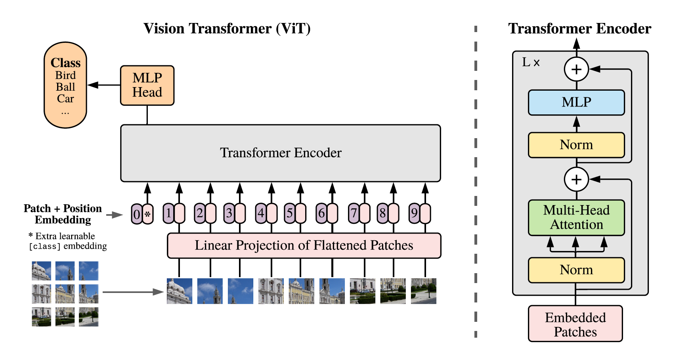

## clip
- 学习一个 多模态嵌入空间 (Multimodal Embedding Space)
- 在该空间中，匹配的图像和文本对具有高相似度，而不匹配的对具有低相似度
- 图像编码器: 可以是 ResNet 或 ViT  文本编码器: 通常是 Transformer bert
- 线性投射层: 分别将图像特征和文本特征投射到共享的多模态嵌入空间
- 训练两个编码器和投影层
**零样本迁移** 任意图分类任务，用自然语言描述类别 就可以分类
**自然语言监督**（Natural Language Supervision） 是一种利用自然语言文本作为监督信号的机器学习范式，核心是用文本描述替代人工标注的标签，实现模型的无 / 弱监督预训练。
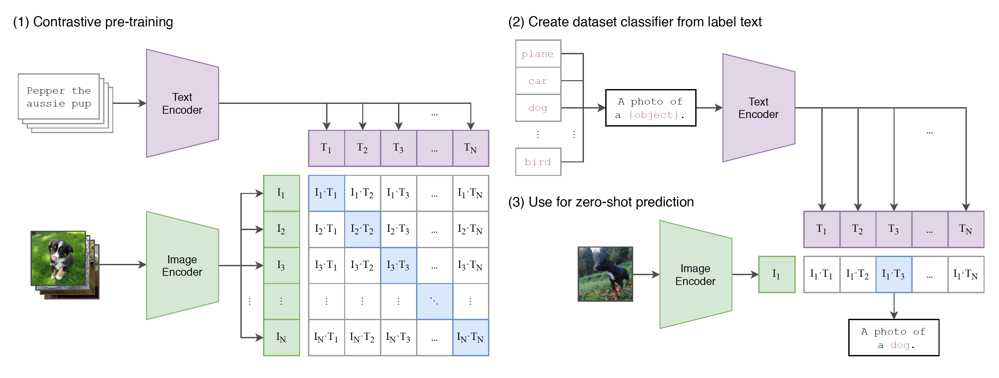

## BLIP
- 之前的模型常只能擅长理解或生成之一 视觉语言的的理解和生成分别是什么任务
- 图像编码器: 采用 ViT
- 文本编码器：三个版本
  - **单模态编码器**
  - **基于图像的文本生成编码器**/**基于图像的文本生成解码器**:通过交叉注意力 (Cross-Attention, CA) 层注入视觉信息，编码器生成图文对的理解信息，解码器用于生成文本任务
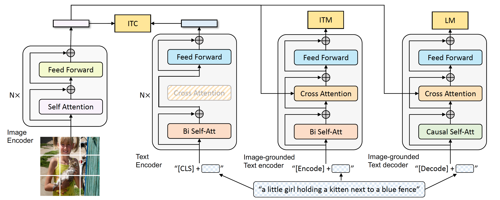

## BLIP-2 2023
BLIP-2 (Li et al., 2023) 针对高昂 VLP 训练成本，提出高效预训练策略：冻结预训练图像编码器与大语言模型，只训练轻量桥接模块 Q‑Former。

- 训练一
将 Q-Former 连接到 冻结的图像编码器，使用图文对进行预训练，目标是让 Q-Former 的查询向量学会提取与文本最相关的视觉表示。
Q-Former图像 Transformer 和文本 Transformer ，Q-Former 输出的查询特征 Q′ 会被拼接在文本 token 序列的开头
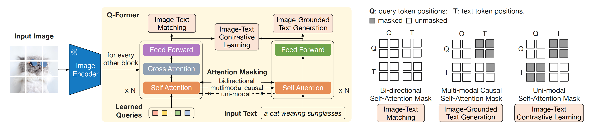
- 训练二
第一阶段预训练好的 Q-Former (及其连接的冻结图像编码器) 连接到 冻结的 LLM，训练Q-Former，使得其输出的视觉表示能够被冻结的 LLM 理解并用于生成文本。
Q-Former架构中的文本Transformer 和 图像 Transformer 怎样传递信息
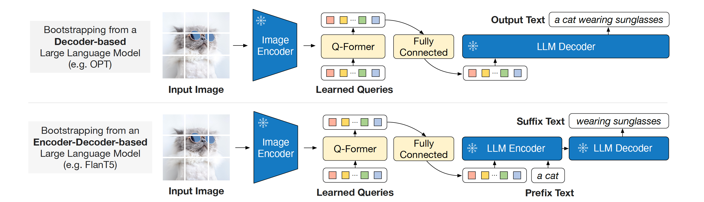

## LLaVA 2023
简单的将图像-标题对扩展为 (指令：描述图像，图像 -> 回答：标题) 的格式虽然廉价，但缺乏指令和响应的多样性及深度推理。
通过特征对齐+指令微调 使得普通的预训练大模型获得多模态大模型能力+更强的复杂推理能力

#### 指令微调是什么
- 指令微调是在预训练大模型（如 LLaMA、GPT）的基础上，使用包含指令 - 输出对的数据集进行二次微调，让模型学习 “指令输入 → 目标输出” 的映射关系。
- 指令：自然语言描述的任务要求，例如 “描述这张图片的内容”“判断图中动物是否为猫”“计算图中物体的数量”。
- 输出：符合指令要求的答案，例如图片描述文本、分类结果、计数结果等。
- 预训练的大模型对指令做出正确反应的能力较弱

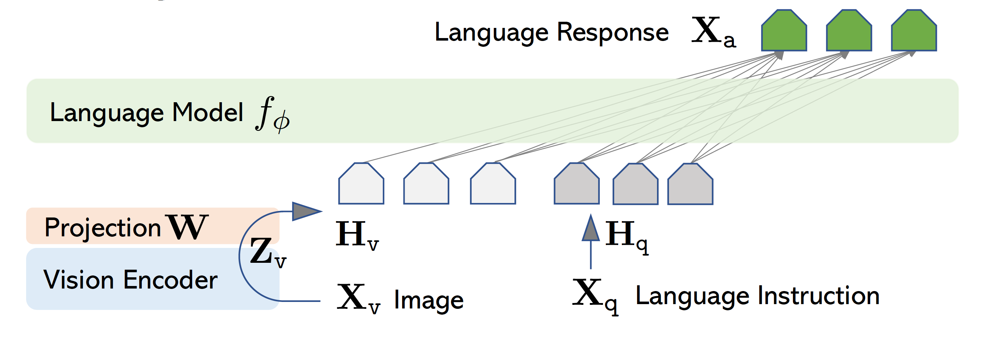
解决方案: 使用 GPT-4 作为“教师模型”,生成微调指令数据集，由于这些模型仅接受文本输入，研究者将图像内容通过符号表示 传递给它们，
图像描述: 提供图像场景的整体或多方面描述。
边界框: 提供图像中对象的类别概念及其空间位置信息 

LLaVA 采用两阶段指令微调流程。
阶段一：特征对齐预训练,图像编码器生成视觉特征 与 LLM 的词嵌入空间对齐，使用图文对数据集
阶段二：端到端微调 用gpt4生成的指令数据集微调接收图像特征的llm

## Qwen-VL 2023
Qwen-VL 采用“三阶段” 逐步训练策略，将视觉感知能力注入通用大模型。第一阶段冻结 LLM 仅训练视觉模块，第二阶段解冻联合多任务训练，第三阶段指令微调得到聊天模型。 
提升图像理解、跨模态检索、定位、阅读等能力，**多模态对话、指令跟随和复杂推理能力**
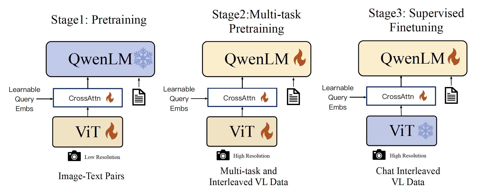

## Qwen2-VL 2024
处理可变分辨率视觉输入和融合多模态位置信息方面
原生动态分辨率 (Naive Dynamic Resolution)
    2D 旋转位置编码 (2D Rotary Position Embedding, 2D-RoPE) (Su et al., 2024; Su, 2021) 来编码二维空间信息
多模态旋转位置编码 (Multimodal Rotary Position Embedding, M-RoPE): 提出了一种新的位置编码方法，可以统一处理文本、图像和**视频**的位置信息。将 RoPE 分解为 **时间** (Temporal)、高度 (Height)、宽度 (Width) 三个分量。

训练: 沿用 Qwen-VL 的三阶段训练
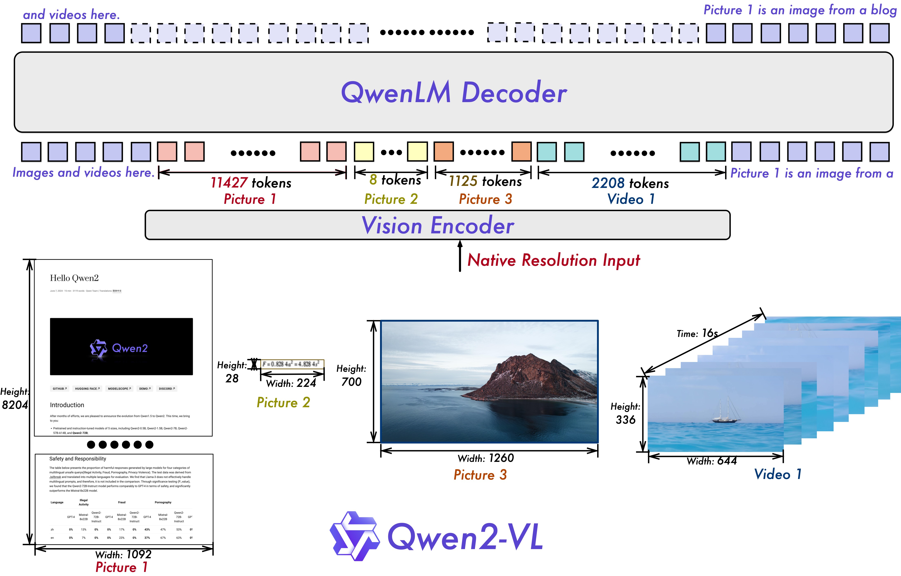
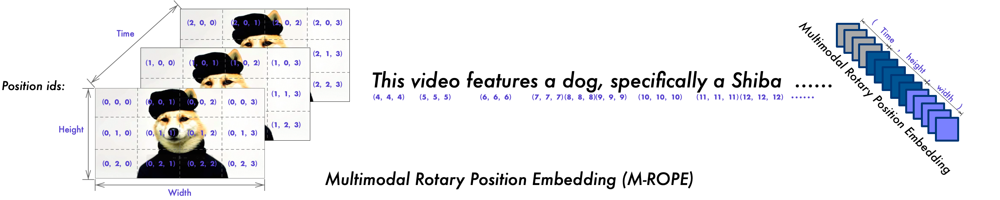 

## Qwen2.5-VL 2025
高效 ViT 架构
动态 FPS 采样与视频处理
模型在大规模（4.1T tokens）、高质量数据集上进行预训练与微调

## Qwen2.5-Omni 2025
端到端多模态模型，支持处理包括文本、图像、音频和视频全模态的输入，并能同时 流式生成文本和自然语音输出
端到端：
模型直接接收原始输入，经过内部一次连续的计算，直接输出最终目标结果，全程不需要人工设计的中间处理步骤或手动特征工程
- 统一多模态处理与时序建模
- Thinker-Talker
- 高效流式处理能力
    - Diffusion Transformer (DiT)
    - 滑动窗口块注意力  感受野
训练: 包含三个阶段：编码器与 LLM 对齐 -> 全模型多模态预训练 -> 长上下文预训练 (32k)。Talker 单独进行三阶段训练：上下文学习 -> DPO (优化稳定性) -> 多说话人指令微调 (提升自然度)。
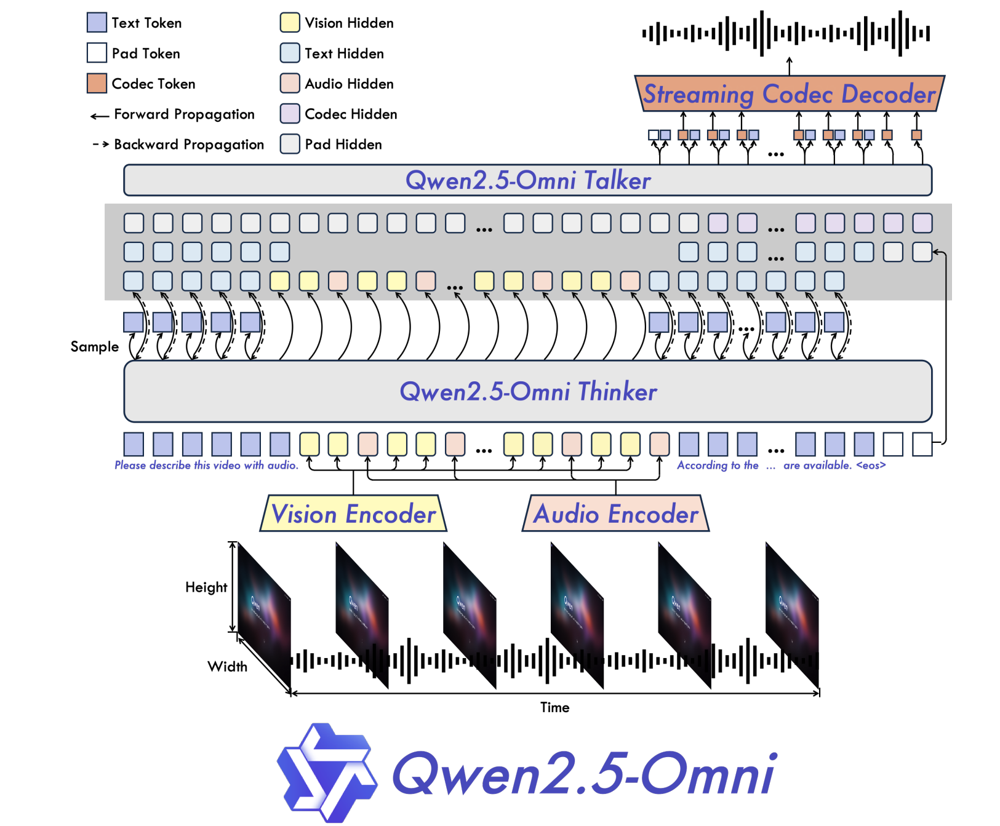

## Kimi-VL 2025
语言模型部分采用 MoE 架构  总参数 16B，每次推理仅激活 2.8B 参数
视觉编码器 MoonViT，支持图像 原生分辨率处理
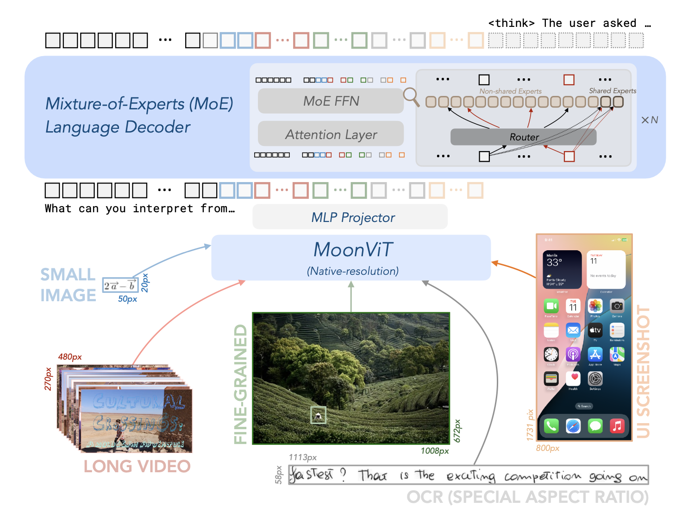
训练
- 预训练
  - ViT 训练
  - 联合预训练
- 后训练
  - 联合 SFT(多模态指令监督微调)
  - 强化学习

## o3 & o4-mini
核心特点是 更长的思考时间 (Longer Thinking Time) 和 全面的工具接入 (Full Tool Access)。
多模态推理: 模型可以将 图像直接整合进其思维链，实现视觉和文本的深度融合推理，而不仅仅是将图像作为输入,在其内部推理步骤中引用和分析图像内容
长时间思考  在推理时增加计算量（如多次采样、使用更长的推理链、MCTS 等搜索算法）来提升复杂任务的性能
