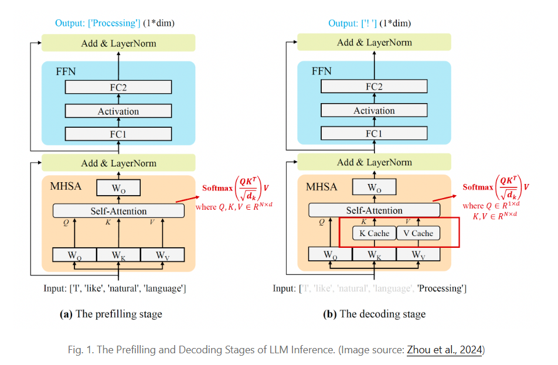
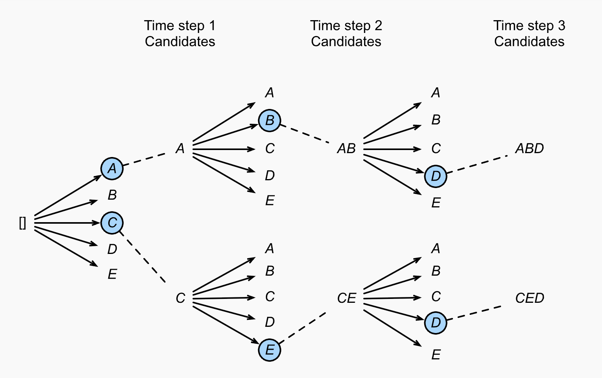
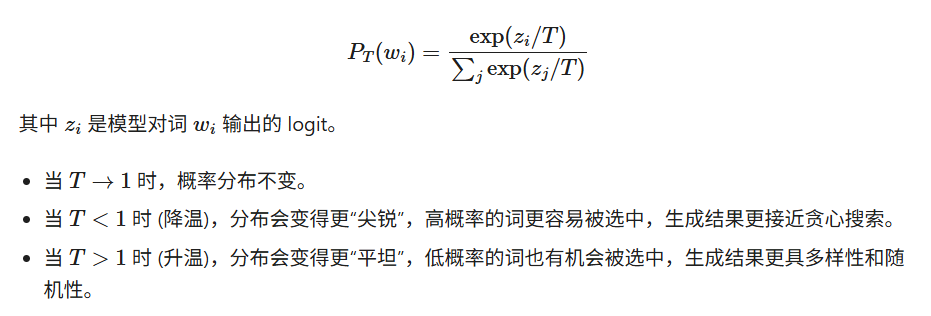
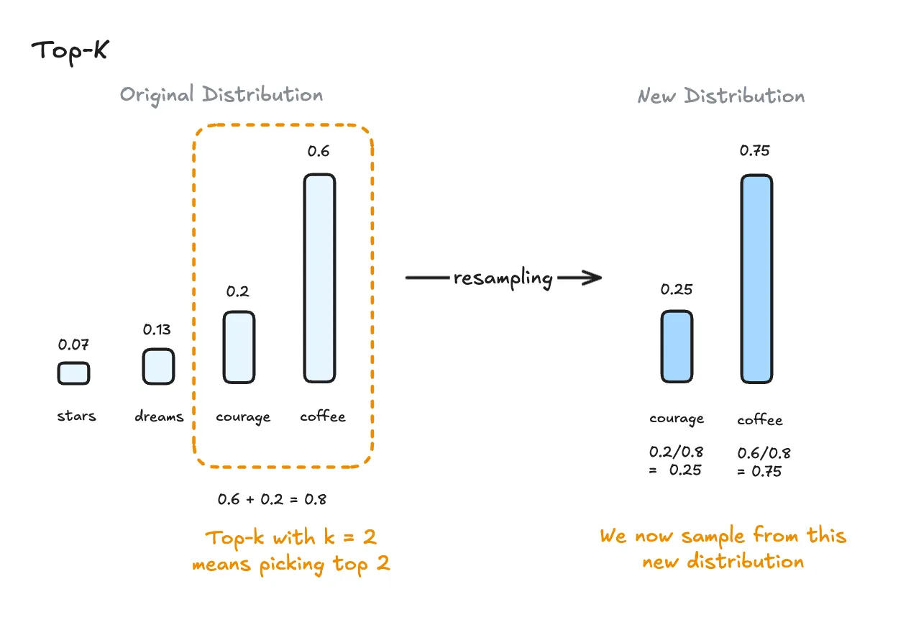
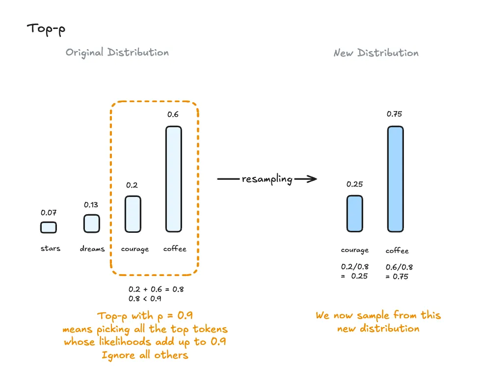
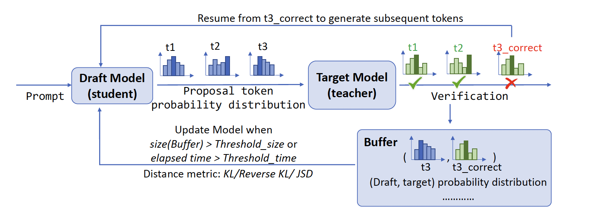
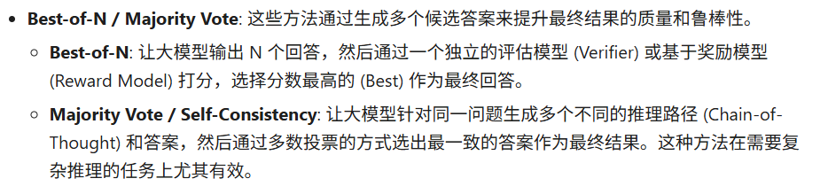
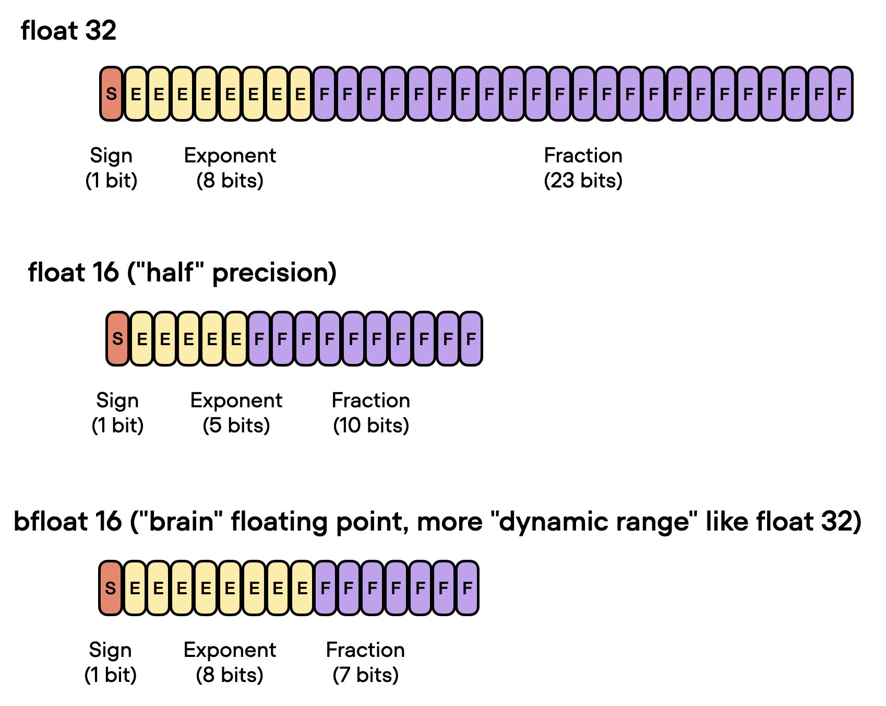
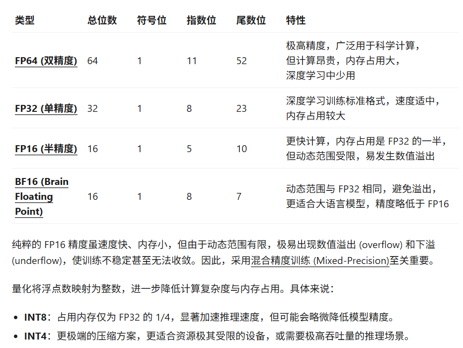

https://syhya.github.io/zh/posts/2025-06-29-llm-inference/
# Token 生成原理
## Prefilling 与 Decoding

- Prefilling 并行计算输入所有token的 Q K V,所有Q的注意力，计算密集型 
- decoding 逐个计算新生成的token的输出 加载之前缓存的token的 K,V,然后之计算最新的token对应的Q的注意力，内存访问密集
## 解码策略
- 贪心 只选概率最高的token输出
- 束搜索
  - 每个解码步骤只保留前k个最优token
  - 然后基于这k个序列扩展，扩展后还是只保留k个最优
  - 
- 温度采样
  - 温度采样通过一个温度系数T来调节原始概率分布的形状
  - 温度越高越平坦，越低越尖锐
  - softmax的改进算法，处理未通过softmax的Logits 
  - 
- Top-K 采样
  - 只保留概率最高的k个候选词，然后在这k个词中重新进行归一化和采样,防止了模型从概率极低的词中采样
  - 
- Top-p 采样
  - 动态选择候选词集合。从概率最高的词开始，累加它们的概率，直到总和超过一个预设的阈值 (例如 0.9)，这种方法兼顾了文本的连贯性和创造性，是目前开放式文本生成中最常用且效果最好的策略之一。
  - 
- 多个采样方法结合 先调温度、再过滤 Top-K、最后过滤 Top-p，在采样出的概率分布中随机选一个token

## 推测解码
- 旨在用小模型的速度实现大模型的生成质量，从而在不牺牲生成质量的前提下降低延迟。
- 使用一个小型、快速的 Draft Model 一次性生成多个候选Token(长度为k)
- 大型的Target Model 并行地对这k个 Token 进行一次前向传播验证。
  - 如果Draft Model预测的 Token 与Target Model一致，那么这些 Token 就被接受，从而实现了一次前向传播生成多个 Token 的效果。
  - 如果不一致，则丢弃草稿模型的后续预测，并使用目标模型的预测进行修正
- 

## 启发式策略

# 优化方法
- 目的 降低延迟 (Latency)、提高吞吐量 (Throughput) 、减少内存占用 (Memory Footprint)
- 方法 模型压缩、内存与计算优化、以及高效模型架构
- 应用各种并行技术，将模型扩展到大量 GPU 上。通过对模型组件和数据的智能并行化，可以运行数万亿参数的模型。
- 内存卸载，将暂时不用的数据卸载到 CPU，在需要时再读回。这有助于减少内存使用，但会增加延迟。
- 智能批处理策略；例如，EffectiveTransformer 将连续的序列打包在一起，以消除批处理中的填充 (padding)。
  - 批处理 单个序列的输入形状是 [1, seq_len]，批处理输入形状是 [batch_size, max_seq_len]，对齐多个序列，同时输入计算可以发挥gpu并行能力，降低数据传输次数->降低开销，提升内存利用率，但是要求输入的张量是规整的，因此需要padding长度不同的序列
- 网络压缩技术，如剪枝 (pruning)、量化 (quantization)、蒸馏 (distillation)。参数数量或位宽更小的模型，自然需要更少的内存和更快的运行速度。
- 针对特定模型架构的改进。许多架构上的改变，特别是针对注意力层的改进，有助于加快 Transformer 的解码速度。

## 知识蒸馏 
- 一个早期的成功案例是 DistilBERT (Sanh et al. 2019)，它能够将 BERT 的参数减少 40%，同时在下游微调任务上保持 BERT 97% 的性能，并且运行速度快 71%。DistilBERT 的预训练损失是软蒸馏损失、监督训练损失 (在 BERT 中即掩码语言建模损失 
) 以及一个特殊的余弦嵌入损失的组合，后者用于对齐教师和学生模型之间的隐藏状态向量。

## 量化
- 量化将模型的浮点权重转换为低位宽的整数表示
- 训练后量化 (Post-Training Quantization, PTQ)：首先将模型训练至收敛，然后在不进行更多训练的情况下将其权重转换为较低的精度。与训练相比，这种方法的实现成本通常很低。
- 量化感知训练 (Quantization-Aware Training, QAT)：在预训练或进一步微调的过程中应用量化。QAT 能够获得更好的性能，但需要额外的计算资源和对代表性训练数据的访问。
#### 精度对比
- 数值精度决定着计算速度和模型性能之间的微妙平衡
- 
- 
## 剪枝
彩票假设 (Lottery Ticket Hypothesis, LTH) 一个随机初始化的密集神经网络中蕴含着某些稀疏子网络 (即“中奖彩票”)，这些子网络在单独训练时即可达到与完整网络接近甚至更好的性能
模型中只有一小部分参数真正发挥了关键作用，这表明大量参数并非用于解决过拟合问题，而主要是提供了充足的初始化搜索空间，使得高性能子网络能够被发现。

- 网络剪枝 (Pruning) 通过删除不重要的模型权重或连接来减小模型规模，从而实现模型压缩，同时尽可能保持模型的性能
- 非结构化剪枝：可随意丢弃网络中任意位置的权重或连接，破坏了原始网络的结构规律。由于这种方式产生的稀疏模式难以适配现代硬件架构，通常无法有效提升实际推理效率。
- 结构化剪枝：通过裁剪整个结构 (如卷积核、通道或层) 来保持网络的结构性，使剪枝后的网络仍然适用于现有硬件优化的密集矩阵计算，从而显著提升实际推理性能。我们在本文中特别关注结构化剪枝，以实现 Transformer 模型中的高效稀疏结构。
  
网络剪枝的典型工作流程包括以下三个步骤：
- 训练一个完整的密集网络，直至收敛；
- 对网络进行剪枝，移除冗余的结构或权重；
- (可选) 进一步微调网络，以恢复剪枝后模型的性能。

剪枝策略 可以是结构化也可以是非结构化
- 幅度剪枝 (Magnitude pruning) 是最简单但相当有效的剪枝方法——绝对值最小的权重被修剪掉
- 渐进幅度剪枝 (Gradual Magnitude Pruning, GMP)  在训练过程中逐渐增加网络的稀疏度,在每个训练步骤，绝对值最小的权重被掩码为零以达到期望的稀疏度水平，并且被掩码的权重在反向传播期间不接收梯度更新
- 迭代剪枝 (Iterative pruning) 在每次迭代中只剪枝一小部分权重，然后重新训练模型。这个过程重复进行，直到达到期望的稀疏度水平

## 混合专家 (Mixture-of-Experts, MoE) 
模型由多个“专家”网络组成，每个输入样本只激活部分专家网络来进行计算
专家网络（Expert Networks）
- 本质：多个结构相同（或相似）的独立子网络，通常是 MLP（如 Transformer 的 FFN 层），每个专家专注于学习数据的某一类模式或特征。
- 在主流的 Decoder-only 架构 LLM（如 GPT 系列）中，FFN 层的权重占比远高于注意力层
  - 例如在多语言翻译任务中：专家 1 擅长英语→法语，专家 2 擅长中文→英语，专家 3 擅长小语种翻译。
  - 例如在视觉任务（V-MoE）中：专家 1 擅长提取边缘特征，专家 2 擅长提取纹理特征，专家 3 擅长提取语义特征。
- 特点：专家之间参数不共享，每个专家都是一个独立的模型分支；模型总参数 = 专家数量 × 单个专家参数，因此 MoE 可以轻松扩展到万亿级参数。

门控网络（Gating Network）
- 本质：一个轻量级的分类 / 回归网络，负责为输入样本（或 Token）计算 “匹配每个专家的权重”。
- 输入：与专家网络相同的输入（如 Token Embedding、图像 Patch 特征）。
- 输出：一个长度等于专家数量的权重向量 g = [g₁, g₂, ..., gₙ]，其中 gᵢ 表示输入样本与第 i 个专家的匹配度。

路由机制（Routing Mechanism）
- 密集路由（早期 MoE）
门控网络为每个输入分配所有专家的权重，最终输出是所有专家输出的加权和,需要激活所有专家，计算量随专家数量线性增长

- 稀疏路由（现代 MoE，如 Sparse Transformer）
门控网络为每个输入选择Top-k 个匹配度最高的专家（通常 k=1 或 2），只有这 k 个专家参与计算，其余专家不激活,实现了 “参数规模大幅增长，但计算量几乎不变” 的目标

## 架构优化
Efficient Transformers: A Survey   https://arxiv.org/abs/2009.06732

KV Cache 优化
- Multi-Query Attention (MQA) & Grouped-Query Attention (GQA)：标准的多头注意力 (Multi-Head Attention, MHA) 中，每个头都有一套独立的 Key 和 Value 投影矩阵。MQA (Shazeer, 2019) 提出让所有的查询头 (Query heads) 共享同一套 Key 和 Value 头，极大地减小了 KV Cache 的体积。
- vLLM(Kwon et al., 2023) 借鉴了操作系统中虚拟内存和分页的思想，提出了 PagedAttention。它将 KV Cache 分割成固定大小的块 (Block)，这些块在物理显存中可以不连续存储，通过一个“块表”来管理逻辑块到物理块的映射,消除了内存碎片 (内部和外部),写时复制极大地提升了并行采样、Beam Search 等复杂解码场景下的吞吐量。
  
FlashAttention
- 标准 Attention 实现的主要瓶颈在于 GPU HBM (高带宽内存) 和 SRAM (片上高速缓存) 之间的数据读写FlashAttention
- 通过 Tiling (分块) 和 Recomputation (重计算) 技术，将整个 Attention 计算融合到一个 CUDA 核中，避免了将巨大的注意力矩阵写入和读出 HBM。这极大地减少了内存访问量，从而在不牺牲精度的情况下，将 Attention 的计算速度提升了数倍