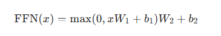

# 待解决问题
1.注意力机制计算细节、原理解释
   - 自注意力 多头注意力
   - 交叉注意力和因果注意力 
2. mask起作用原理 就是因果注意力
   - 将未来位置的注意力分数置为 −∞
3. 怎样处理超长上下文，能支持多长的上下文
   - 最大窗口在100K token
   - 中窗口（8K–32K tokens）：准确率降至 70%–85%，中间非关键信息开始丢失。
   - 长窗口（32K–128K tokens）：准确率 50%–70%，核心信息漏检、幻觉概率显著上升。
4. feed forward add操作的原理
   -  
   - 升维 - 降维
5. 训练任务完成后就可以进行问答问题了吗
   - 基本可以 还需要问答数据集微调
   - 99%微调少量特定层的参数
6. mlp 残差 注意力 激活 norm 池化 卷积 的原理
7. 强化学习 冻结主体参数 训练特定层（可以是精心设计插入的）
   1. 训练哪些特定层
8. 规划 记忆 工具 集成方法是轻量化方法是定制化prompt，企业级的需要添加代码实现状态 记忆管理，异常处理机制
9.  多模态智能体怎样集成 各个模态
    1.  各自提取特征
    2.  多模态特征对齐
    3.  llm多模态注意力融合
        1.  注意力机制的原理
10. 找个多模态融合示例
11. 特定场景智能体实现示例
