# 实践细节
- 一般给定一个机器学习任务需要做哪些处理
- 纯数据集分析学习难度
- 怎样根据数据集特征 选择模型
  - 偏差角度
- 超参搜索
  - 验证集
# 整合
- 过拟合是拟合了训练集的噪声吗
- 经验误差的期望 = 偏差+方差+噪声 - 乐观偏置
- 泛化误差 = 偏差+方差+噪声
- 假设空间
  - 使用weight decay，batch size，learn rate 等优化器设置可以限制假设空间
# 基础
### 三个基础问题 分类 回归 聚类
# 模型评估和选择
### 训练误差（经验误差）or 泛化误差  + 过拟合or欠拟合
**过拟合不可避免**
- 机器学习解决的问题大多>=NP问题 但算法是P, NP≠P
- 使用测试集近似泛化误差
- 验证集上选择模型和调超参数
    - ？？？
### 指标
**错误率和精度**
**查准率precision 和查全率recall**
- 一般相互矛盾
- 平衡点 包住

**ROC和AUC**
- 考察排序质量
 代价敏感错误率
- FP FN代价不同

**测试错误率和泛化错误率**
**偏差、方差和泛化误差**
- 给定：学习算法 A（模型训练程度是算法的一部分） + 训练集大小 n + 数据分布 D
- 泛化误差= 偏差+方差+噪声
  - 这里计算偏差 方差 噪声 使用的x是整体分布上的x
  - 偏差 学习算法期望输出和真实值的差方 代表学习算法的拟合能力
  - 方差 使用相同规模不同数据集训练下的f(x)的方差 数据扰动的影响
  - 噪声 数据集中的标注和真实值的 差方   泛化误差的下界
- 数据集规模增大 方差减小
- 训练程度增大 模型拟合能力增大 偏差减小  方差增大
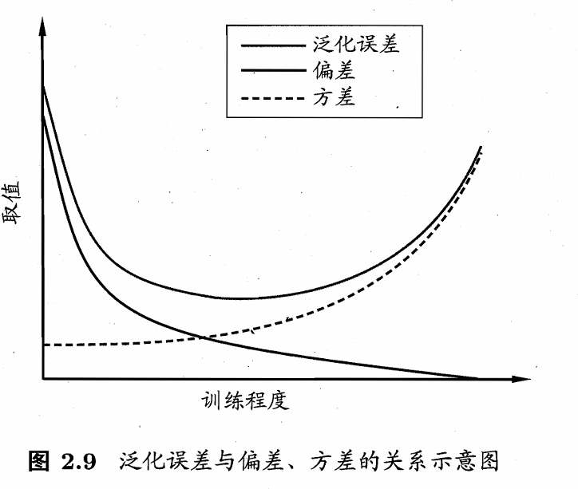
- 经验误差 是泛化误差的有偏估计
  - 单次经验误差 
    - 是模型在单个具体训练集上具体训练结果的的预测误差
  - 经验误差的期望 
    - 这里计算误差使用的x是训练集中的样本
    - 给定 学习算法 A（模型训练程度是算法的一部分） + 训练集大小 n + 数据分布 D
      - 经验误差的期望 = 偏差+方差+噪声 - 乐观偏置
        - 乐观偏置来自模型方差对噪声的“过度利用” 强相关
    -  **只有在模型与训练数据“独立”时，经验误差的期望才等于泛化误差。**

- 测试误差 是泛化误差的无偏估计
  - 只有采样误差 但是采样误差的期望 = 0

**一致损失替代函数**
**K 折交叉验证** 
- 将数据集 D 随机、均匀、无放回地划分为 K 个大小相等（或近似相等）的子集
- 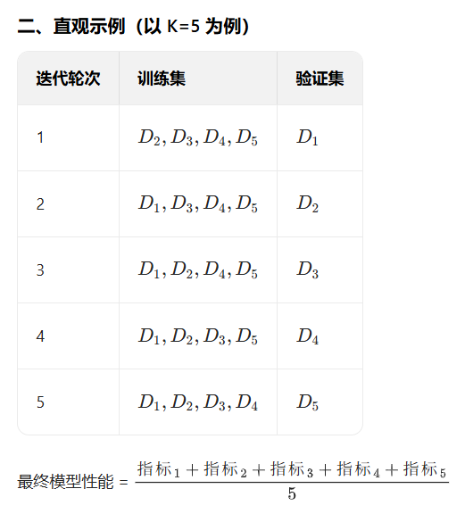
- 更真实反映模型的泛化能力
---
# 线性模型
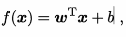
### 二分类->多分类 
-  ECOC编码
### 类别不平衡问题
- 会讨好多数类 所以要人为提高少数类惩罚————再缩放
- grand也有同样的问题???? 随机采一批 正样本对 负样本对

# 决策树
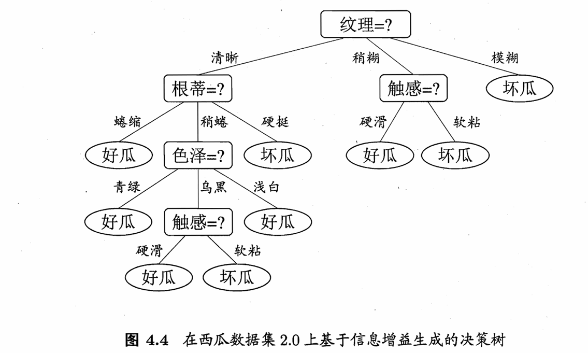
### 信息熵与信息增益
- 将数据集的样本按属性a分类后 使得各个子树中的类别更加纯净
### 剪枝
- 预剪枝
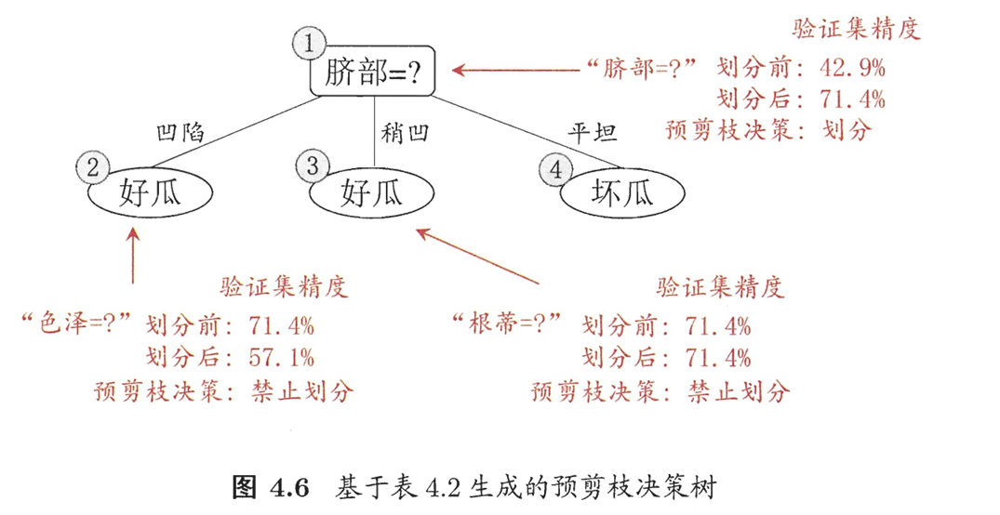
- 后剪枝
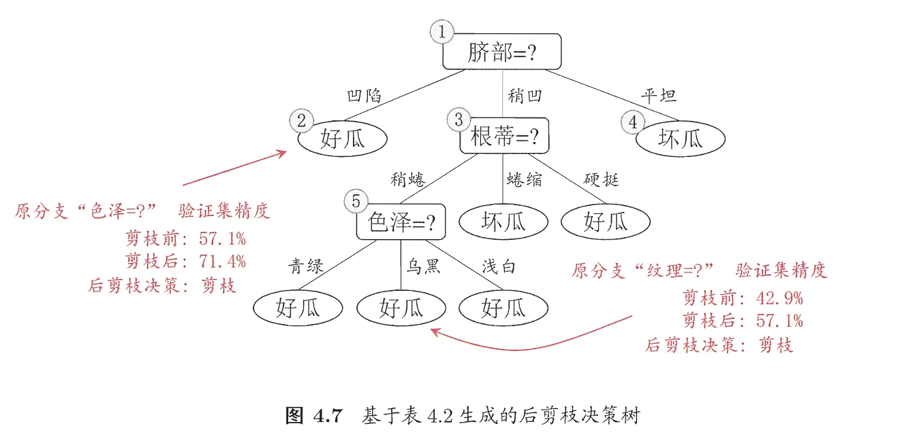

---

# 神经网络
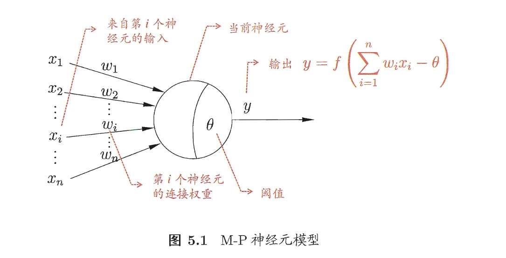
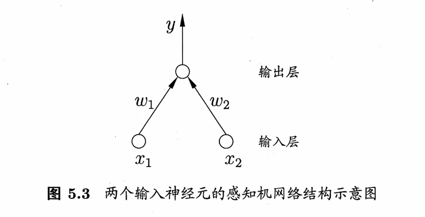

- 增加隐藏层提高网络的表达能力，层数足够多可以逼近任意函数
- 但是设置神经元数量是未知问题，只能试错
### 过拟合
- 由于表示能力强，容易过拟合
- 方法：早停
    - 验证集判断，是否训练集损失下降 验证集上升
    - 正则化 使得网络尽可能简单不复杂，weight decay 是一种方法
### 多层前馈神经网络
- 神经元之间不存在同层连接，也不存在跨层连接.这样的神经网络结构
### 全局最小  局部最小
- 不同初始化方法
- 模拟退火
- 随机梯度下降

# 支持向量机
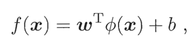
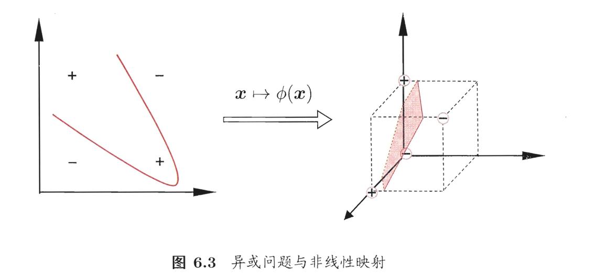
- 核函数映射到高维特征空间
    - 核函数怎么选？
        - 匹配数据的分布特性
    - 有可训练参数吗？
        - 传统 SVM 的核函数参数是固定的，但现代核学习（如多核学习、自适应核）支持训练核函数的参数
    - 目前还有应用吗
        - 小样本、高维稀疏、对可解释性要求高的场景
- 高维特征空间超平面分割训练样本
- 软间隔和正则化
- 替代损失函数

# 贝叶斯分类器
求P(c | x )
1. 直接建模P(c | x)来预测c,这样得到的是“判别式模型" (discriminative models);
    - 决策树、BP 神经网络、支持向量机
2. 先对联合概率分布P(Q,c)建模，然后再由此获得P(c|x)，“生成式模型"(generative models).
    - 贝叶斯分类器
    - 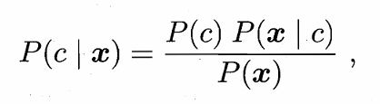
    - 样本足够多可直接求P(c)，对各个类别p(x)都相同，可以抹去，最后求出各个类别看所占比例
    - 但P(x|c)无法求，因为x高维，取值太多，数据集不可能足够大
        - 但是可以假定x满足某种分布，然后拟合x的分布
        - P(x|c)是x多个属性的联合分布
            - 假设x各个属性独立 朴素
            - 假设依赖限制条件 半朴素 
            - 贝叶斯网 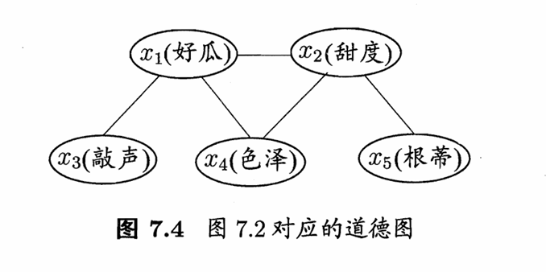需要任务是求出网络结构————评分搜索

# 集成学习
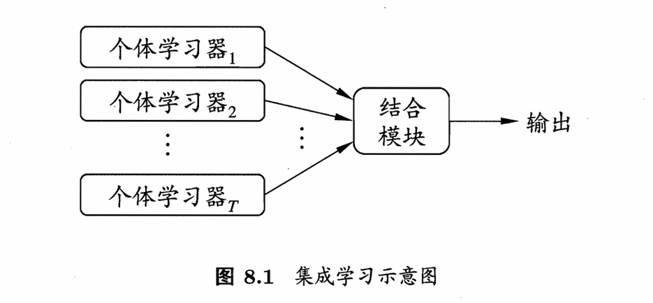
- 集成学习理论基础是规模效应吗？
    - 泛化性 训练集上相当，但是在测试集上都偏离真实值，尽可能多的子分类器合并输出可以逼近真实值（基于统计）
    - 子分类器可能训练到局部最小
    - 多个子分类器可以增大假设空间,特征维度从n，变成T*n
- 子模块强依赖关系 串行
    - boosting 以adaboost算法为例
        - 训练多个分类器 最后加权求和分类器的结果
        - 样本权重 
            - 训练分类器 基于样本权重计算损失；
            - 上一个分类器分类不准，则该样本权重增大，准确则减小，变化比例是exp（分类器权重）的
        - 分类器权重 
            - 当前分类器训练后 的损失越大 权重越低
        - 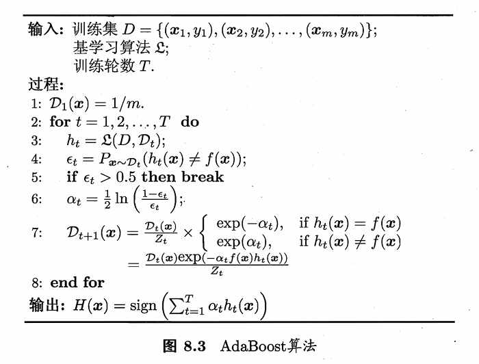
        - 通过降低偏差 提高精度
- 并行
    - 想提高泛化性 需要使得个体学习器差异尽可能大
    - 降低方差
    - bagging
        - 为每个分类器随机采 m个样本，进行独立的训练
        - 所有分类器投票或平均
    - 随机森林
        - 构建多个独立的决策树，通过投票或平均的方式整合所有树的结果
        - 决策树节点分裂时 先随机选择k个属性，然后从k个属性中选一个最优属性分裂

- Stacking 算法 
    - 原始训练集 → [基学习器1, 基学习器2, ..., 基学习器k] → 基学习器预测结果 → 元学习器 → 最终预测
    - 基学习器可以是各种类型，训练数据集可以相同也可以不同
    - 元学习器 学习基学习器预测结果和真实标签的映射关系

# 聚类
- 距离度量
    - 闵可夫斯基距离 （有序属性）
        - 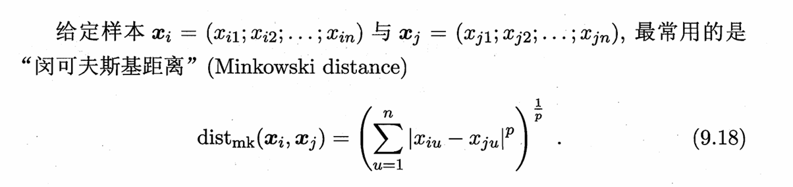
    - 无序属性 VDM (Value Difference Metric)
        - 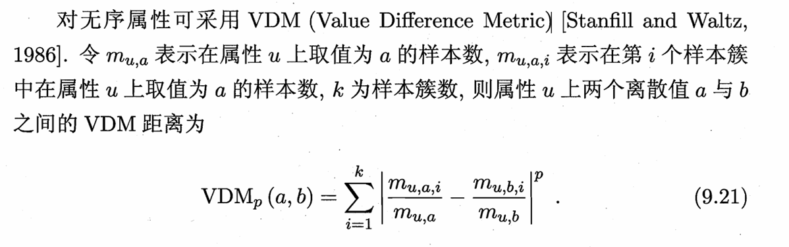
- 原型聚类
    - 假设聚类结构能通过一组原型刻画 需要假定有k个聚类
    - k均值
        - 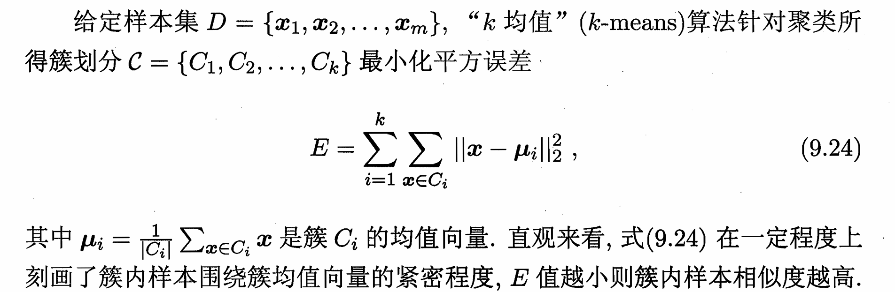
        - 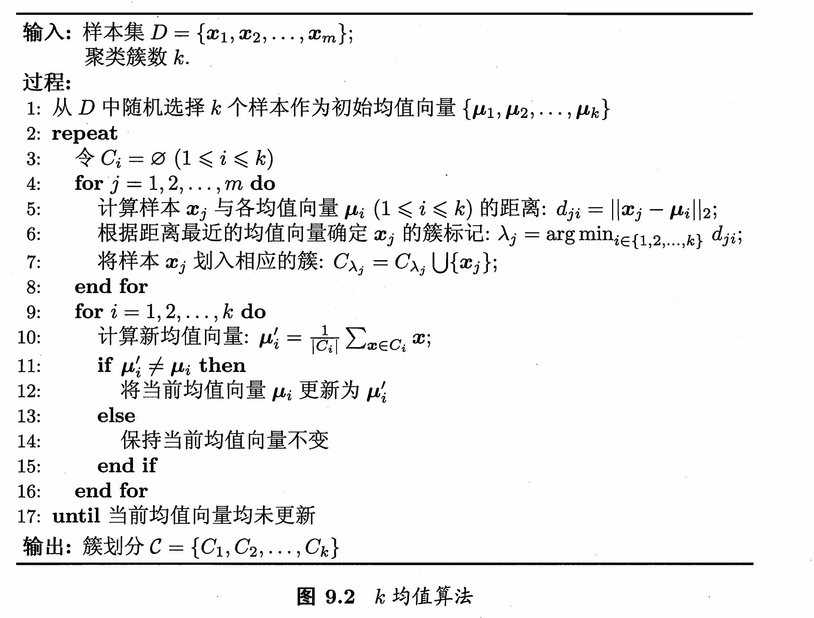
    - 学习向量量化
        - 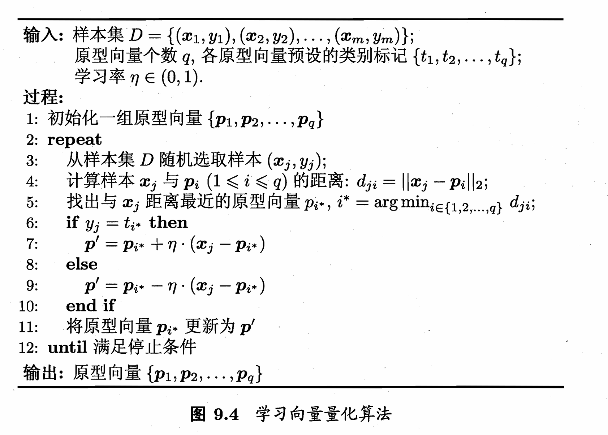
        - 对任意样本叫它将被划入与其距离最近的原型向量所代表的簇中
    - 高斯混合聚类
        - 假设x满足混合高斯分布，由k个高斯分布叠加
        - 一般假设有k个分布 但实际可能 < k 个分布，拟合结果聚类数会小于k
- 非原型聚类
    - 密度聚类
        - 给定参数ε Minpts(min points)
        - ε领域  任意x的ε领域是 距离x小于等于ε的样本
        - 核心对象 ε领域中的样本点数大于Minpts的样本
        - 密度直达 密度可达 密度相连
        - 密度相连的构成一个聚类
        - 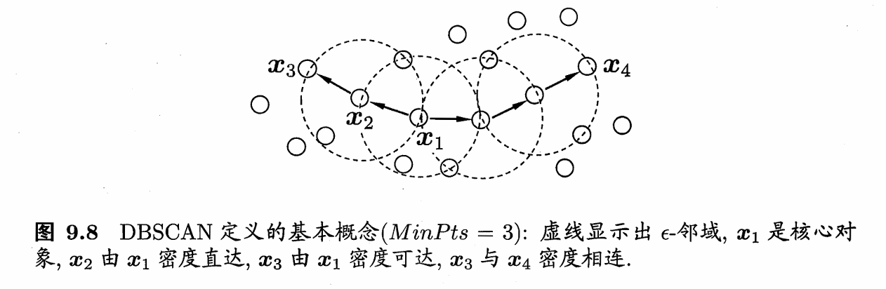
    - 层次聚类
        - 给定聚类数 k
        - 首先假设每个样本是单独的一个聚类
        - 依次合并距离最近的聚类 直到只剩k的聚类

# 降维和度量学习
- k近邻学习
    - 依据k个最近邻的标签投票
    - 懒惰学习 急切学习
- 维数灾难
    - 若对任意给定的测试样本 总能在距离任意小的范围内找到一个最近邻训练样本，则k近邻分类器泛化错误率不超过贝叶斯最优分类器两倍
        - 但是需要训练采样密度很大 
        - 维数越大 同样的样本数 采样密度越低 而且计算量增大 因此需要降维
- 降维
    - 要求原始空间中样本之间的距离在低维空间中得以保持
    - 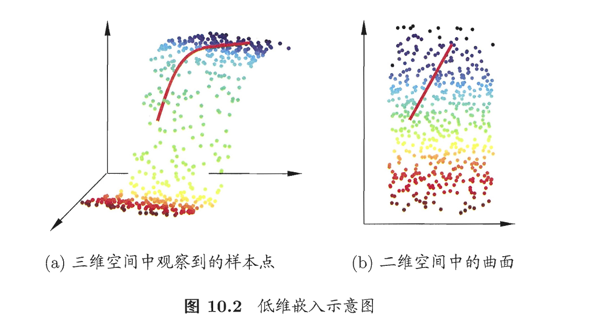
    - 主成分分析 PCA
    - 核化降维
- 度量学习
    - 降维是为了找到一个合适的空间 然后获得合适的距离度量
    - 度量学习直接找一个合适的度量方法
    - 度量矩阵 每个属性距离的权重不同，且可能不正交

# 特征选择和稀疏学习
### 特征选择
- 无关特征 冗余特征
- 子集搜索 搜索特征子集
    - 过滤式
        先按特征自身的统计特性 / 与标签的关联度给特征打分，按分数筛选出 Top-K 特征子集，再将该子集输入到后续模型（如 LR、树模型）中训练
    - 包裹式    
        将机器学习模型作为特征选择的 “评判器”，把模型的泛化性能（如验证集准确率、AUC）作为特征子集的打分标准，通过子集搜索算法（如前向选择、后向消除、遗传算法）遍历不同的特征子集，将每个子集输入模型训练，选择让模型性能最优的特征子集。
    - 嵌入式 神经网络自动完成这个功能？
        将特征选择直接嵌入到模型的训练过程中，模型在学习数据规律的同时，自动完成特征选择，无需单独的特征筛选步骤，是过滤式和包裹式的折中方案。
        简单说：模型训练的过程，就是给特征 “赋权” 的过程，权值为 0 / 接近 0 的特征即为无效特征，直接剔除即可，特征选择和模型训练是同一个步骤。

- 子集评价
    - 根据特征子集对数据集分组
    - 判断分组内的样本类别标签的纯净程度——信息增益
### 稀疏表示
- 把一段看似复杂的原始信息，**保留原始维度**的情况下映射到某个“字典 / 基”下，用极少数非零的 “系数”+ 字典就能精准描述原始信息，大部分系数为 0——零系数越多，稀疏性越强。
- 稀疏编码or字典学习： 将稠密表达的样本变为稀疏表示
    - 字典学习是一种无监督的特征学习 / 降维方法，也叫稀疏编码（Sparse Coding），**核心目标是从原始数据中自动学习一组 “基向量”（称为字典），使得原始数据可以通过这组基向量的稀疏线性组合来近似表示，基向量个数手动指定**
    - 用 10 个关键词描述一篇 1000 字的游记，其他的词语都是0
    - 一张 512×512 的自然风景图 映射为一组系数 ——只有山峰边缘、湖泊轮廓、白云纹理处的系数非零（代表图像的 “关键特征”），蓝天、平滑背景的系数全为 0
- 好处：
    - 轻量化 大幅减少数据存储 / 传输的体量
    - 抗噪性强：稀疏表示只保留信息的核心特征，噪声通常表现为零散的非核心系数，可直接剔除，实现天然去噪
    - 特征提取更高效：稀疏系数是原始信息的 “本质特征向量”，将其输入机器学习 / 深度学习模型，能避免冗余信息干扰，提升模型训练效率和泛化能力；
- 应用
    - 计算机视觉：图像去噪 / 修复、人脸识别 / 目标检测、图像超分辨率重建、视频压缩（提取视频帧的稀疏特征，减少帧间冗余）；
    - 信号处理：心电 / 脑电（ECG/EEG）信号去噪与特征提取、雷达 / 声呐信号处理、语音去噪 / 识别（将语音信号转化为稀疏系数，提升鲁棒性）；
    - 机器学习 / 深度学习：高维特征的前置降维（如金融风控的千维特征稀疏化）、少样本学习（稀疏特征提升小样本下的模型性能）、生成式模型（GAN 结合稀疏表示提升生成精度）
    - 工业检测：工业设备的振动信号稀疏化，提取故障特征，实现设备故障诊断
    - 自然语言处理：文本的词向量稀疏表示，剔除冗余词汇，提升文本分类、情感分析的效率
### 压缩感知
- 基于原始信息的稀疏表示，跳过 “全量采集原始信息” 的步骤，用远低于传统方式的采样率，只采集原始信息的少量关键测量值（采集过程就是压缩过程），再通过算法，从这少量测量值中精准恢复出原始全量信息。
- 流程
    - 稀疏性 稀疏表示是压缩感知的必要前提，原始数据是显示或隐示稀疏表示的
    - 非相干测量 只采集重点的采样方法   
    - 稀疏重构  基于采集的关键值 恢复原始信息
- 好处：
    - 降低采样 / 采集成本
    - 采集与压缩合一，不需要先采集 后压缩

# 计算学习理论
- 假设空间 
  - 理想的分类函数位于 假设空间
  - 不在假设空间
- PAC（概率近似正确，Probably Approximately Correct）
  - 对于某个问题 存在算法能以较大的概率（置信度）学得误差足够小（近似正确）的模型，同时要求学习的样本复杂度和时间复杂度为多项式级（保证实际可实现）。
  - 验证方法
    - 第一步：判定问题是否 PAC 可学习
      - 有限假设空间 一定PAC 可学习
      - 无限假设空间  **VC 维**有限 <=> PAC可学习
    - 第二步 验证是否存在多项式时间的 PAC 学习算法————高效 PAC 可学习
      - 是否存在算法满足「多项式时间搜索 + 经验风险最小化（ERM）」
-  VC 维 
   -  定义 能被假设空间H**打散**的最大数据集的大小
      -  打散 若假设空间能给出数据集的所有可能输出结果 则成数据集能被H打散
   -  VC 维是假设空间的固有属性，仅由H的表示能力决定
   -  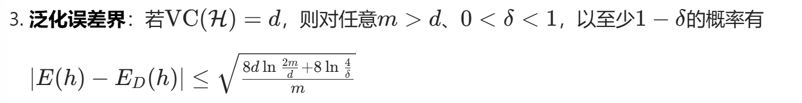
   -  VC 维越大，假设空间表示能力越强，经验误差可越小，但泛化误差的上界越大，泛化误差和经验误差的差异上界越大
   - 指导意义：减小泛化误差的方法 
     - 使用更简单的模型 减小假设空间
       -  通过归纳偏好缩小有效假设空间
       -  通过正则化显式限制模型复杂度
     -  增大样本数
   - VC维无限 不可学习
     - 无约束神经网络是 未做任何结构、参数、训练策略限制的神经网络模型的统称
- Rademacher 复杂度 
  - 由假设空间+数据分布 决定 给出比VC维更紧的泛化误差界限
  - 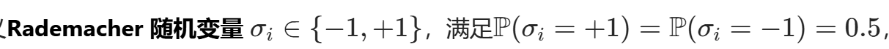
  - 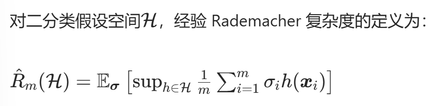
  - 数据越复杂 or 模型越复杂 ->Rademacher复杂度越大 
  - 泛化误差≤经验误差+数据分布相关的复杂度项（与Rademacher 复杂度正相关）+样本数相关的收敛项（随着样本数增大而减小的项）
  - 指导意义
    - 给定数据集 对不同的候选模型 计算Rademacher 复杂度 分析泛化误差
    - 过拟合防控
      - 正则化、减少模型参数、早停 降低模型复杂度
        - 通过Rademacher 复杂度量化不同正则化策略的效果
      - 数据清洗、去噪声、特征工程简化数据分布
    - 评估任务的实际难度
- 稳定性
  - 定义
    - 固定一个学习算法 
    - 给定训练集
    - 移除替换惹任意一个数据 得到不同的模型
    - 不同的模型的之间的损失差恒小于β
    - 算法是β-均匀稳定
  - 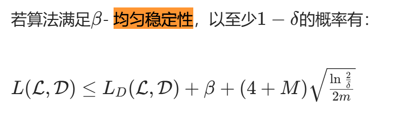
  - 指导意义
    - 设置学习率 批次大小，训练轨迹不能对单样本过度敏感
    - β和正则化强度相关 正则化可以提升稳定性，抑制单样本对最优解的影响
    - SVM、岭回归、K 近邻的泛化性良好与β稳定性有关